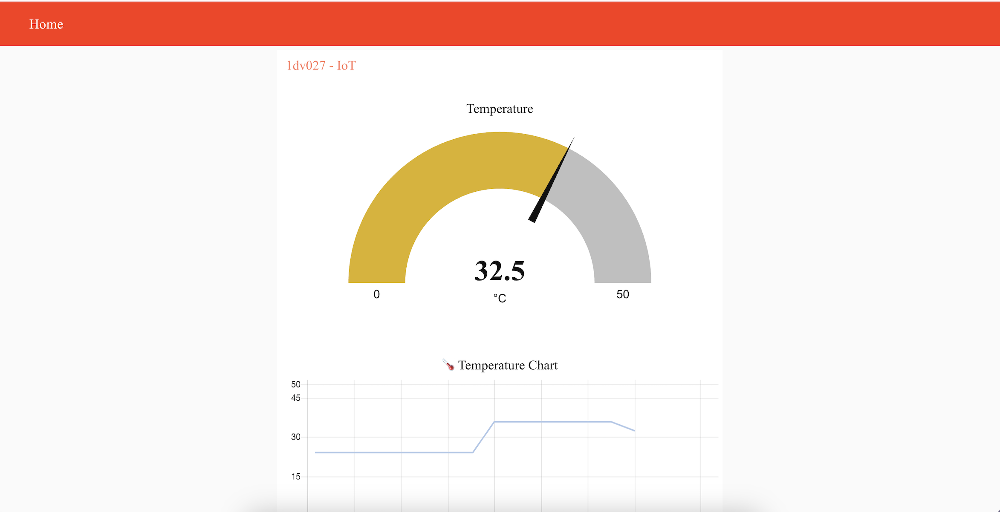
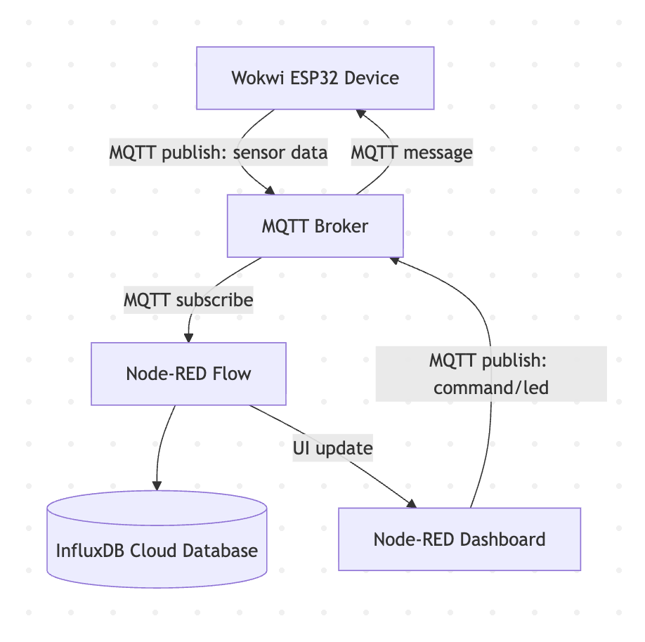
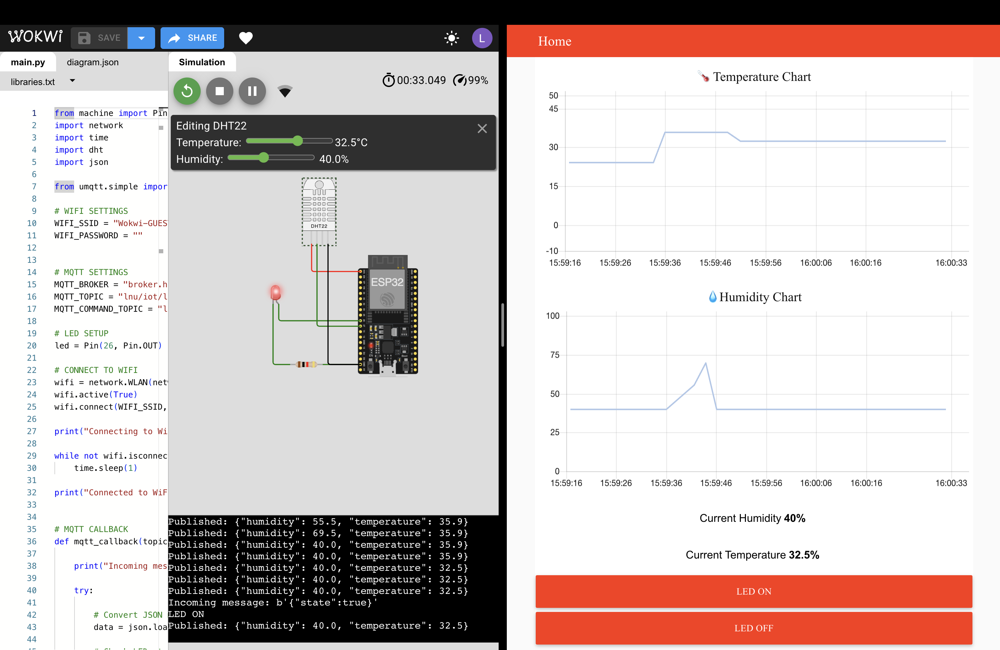

# Assignment: Internet of Things (IoT)

### 1) Project Links
- **Live Dashboard URL:** Render - [https://assignment-iot.onrender.com/ui](https://assignment-iot.onrender.com/ui)

Note: The Render free-tier deployment may require up to one minute to wake from inactivity.
- **Wokwi Simulation URL:** [Public Wokwi project link](https://wokwi.com/projects/463906891539102721)
- **Backend/Database URL:** [https://assignment-iot.onrender.com](https://assignment-iot.onrender.com)
- **Repository URL:** [GitHub](https://github.com/lenapear/assignment-iot)

### 2) Project Overview

#### Dashboard Interface

The dashboard displays live sensor values, historical chart visualisation, and LED control buttons for interacting with the simulated device.



#### Note About Historical Data

The dashboard queries and visualizes the most recent 30 minutes of sensor data from InfluxDB.

If no simulator data has been published within the last 30 minutes, the historical charts may initially appear empty. To generate new historical data, start the Wokwi simulation and allow sensor values to publish for a short period of time.

Live dashboard updates and historical visualization will then begin automatically.

### 3) Architecture and Data Flow



The system follows a publish-subscribe architecture using MQTT as the communication protocol.

The Wokwi simulated device publishes sensor data (temperature and humidity) to a public MQTT broker. Node-RED subscribes to this topic, processes incoming messages, and stores the data in InfluxDB for persistence.

The dashboard displays real-time MQTT updates while historical sensor data is retrieved from InfluxDB using query nodes.

Dashboard interactions publish MQTT control messages back to the Wokwi device, allowing LED control.

#### System Demonstration

The image below demonstrates the communication between the Wokwi simulator and the deployed dashboard. Sensor data is published in real time while dashboard commands control the LED state on the simulated ESP32 device.



### 4) Database Strategy
The system uses InfluxDB Cloud as a time-series database for storing sensor data.

#### Data Model
**Measurement:** environment
**Fields:**
- temperature (°C)
- humidity (%)

**Timestamp:** automatically generated or derived from incoming data

InfluxDB was chosen because it is optimized for continuous time-series data. It allows efficient storage and querying of sensor data over time.

The system queries the last 30 minutes of data for historical visualization. A retention policy of 30 days ensures old data is automatically removed to manage storage usage.

### 5) MQTT Topics and Payload Documentation

#### MQTT Broker - broker.hivemq.com
#### Sensor Data (Wokwi → MQTT Broker)
**Topic:** lnu/iot/ll224ve/sensor
**Payload:**
```json
{
  "temperature": 22,
  "humidity": 55,
  "timestamp": 1710063386
}
```
#### LED Control (Dashboard → Device)
**Topic:** lnu/iot/ll224ve/command/led
**Payload:**
```json
{
  "state": true
}
```

The sensor topic is used by the Wokwi device to publish environmental data.

The command topic is used by the dashboard to send control messages to the device, enabling bi-directional communication. There is a LED OFF button that sends the payload with the state "false" back to turn it off.


### 6) Reflection
For this project, Node-RED was chosen as both the backend and dashboard solution because it provided a simpler and faster way to build the IoT pipeline within the limited assignment timeframe. Since this was my first larger IoT project, I wanted to focus on understanding the core concepts such as MQTT communication, real-time data handling, database integration, and device control before building a more custom solution.

Using Node-RED made it easier to connect MQTT, InfluxDB, and the dashboard together without needing to spend most of the time building frontend and backend infrastructure from scratch. However, since I already have previous experience with frontend development, I could see myself building a custom dashboard in the future now that I better understand how the underlying IoT communication flow works.

Real-time MQTT communication differs from traditional REST APIs because data is continuously pushed between devices and services instead of being manually requested through separate HTTP calls. This allows the dashboard to update almost instantly when new sensor values are published.

The most challenging part of the project was configuring communication between all system components and troubleshooting deployment issues related to cloud-based services, credentials, and database connections.